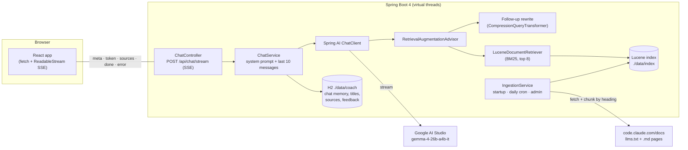

# claude-code-coach

A chatbot that answers questions about **Claude Code** (Anthropic's agentic coding tool) for Java
developers, grounded in the official docs at [https://code.claude.com/docs](https://code.claude.com/docs), with source links.

> This app was built using Claude Code with Opus 5.5 by **Ruthran Raghavan**, Chief AI Scientist,
> <https://ruthranraghavan.com>

- **Model:** `gemma-4-26b-a4b-it` via Google AI Studio (Gemini Developer API). No other model is used anywhere.
- **Backend:** Java 21, Spring Boot 4.1.1, Spring AI 2.0.1, Lucene 10.5.1 (BM25, no embeddings), H2 (file).
- **Frontend:** Vite, React 19, TypeScript (strict), Tailwind CSS v4, shadcn/ui, lucide-react.

## Prerequisites

| Tool              | Version                                 | Check                      |
| ----------------- | --------------------------------------- | -------------------------- |
| JDK               | 21 or newer (the build targets 21)      | `java -version`          |
| Node.js           | 20.19+ or 22.12+                        | `node -v`                |
| Docker (optional) | Docker Desktop / Engine with Compose v2 | `docker compose version` |

Maven isn't needed: the backend ships the Maven wrapper (`./mvnw`).

## Get a Google AI Studio API key

1. Open [https://aistudio.google.com/apikey](https://aistudio.google.com/apikey) and sign in with a Google account.
2. Click **Create API key** and copy it.
3. The free tier works; it has per-minute and per-day request limits (see Troubleshooting).

## Environment variables

| Variable                  | Required | What it does                                                                             |
| ------------------------- | -------- | ---------------------------------------------------------------------------------------- |
| `GEMINI_API_KEY`        | yes      | Google AI Studio key. Read only by the backend; never sent to the browser or logged.     |
| `ADMIN_TOKEN`           | no       | Enables`POST /api/admin/reindex`. Without it the endpoint returns 403.                 |
| `COACH_THINKING_LEVEL`  | no       | Gemma thinking level: `NONE` (default), `LOW` or `HIGH`. Google currently rejects `LOW`/`HIGH` for this model. Thoughts are never shown. |
| `COACH_REINDEX_CRON`    | no       | Daily docs refresh, Spring cron format. Default`0 0 3 * * *` (03:00).                  |
| `COACH_ALLOWED_ORIGINS` | no       | CORS origin(s) for the browser. Default`http://localhost:5173`.                        |
| `COACH_DATA_DIR`        | no       | Where the H2 database and Lucene index live. Default`./data`.                          |
| `BACKEND_PORT`          | no       | Local runs only: backend port, also used by the Vite `/api` proxy. Default `8080`.     |
| `COACH_PORT`            | no       | Docker only: host port of the web app. Default`8081`.                                  |

All other settings (temperature, max tokens, top-k, rate limits, chunk sizes…) are in
`backend/src/main/resources/application.yml`.

## Quick start (one command)

```bash
git clone https://github.com/hereandnowai/claude-code-coach.git
cd claude-code-coach
./run.sh
```

The script checks Java and Node, asks for your Google AI Studio key the first time (and saves it to
`.env`), picks a free backend port if 8080 is taken (Jenkins, another app), installs the frontend
packages, starts both halves and opens the app in Google Chrome (or your default browser if Chrome
isn't installed; `OPEN_BROWSER=0 ./run.sh` skips it).
`Ctrl+C` stops everything. Backend logs go to `backend.log`.

## Run locally (step by step)

```bash
# 1. Backend (http://localhost:8080)
cd backend
export GEMINI_API_KEY=your-key        # or: cp ../.env.example ../.env and fill it in
./mvnw spring-boot:run

# 2. Frontend (http://localhost:5173), in a second terminal
cd frontend
npm install
npm run dev
```

Open [http://localhost:5173](http://localhost:5173). The Vite dev server proxies `/api` to the backend.

The first start downloads the Claude Code docs (about 210 pages) and builds the search index in the
background, which takes about 20 seconds. `GET http://localhost:8080/api/health` shows progress
(`index.details.state`: `INDEXING` → `READY`).

> **One `.env` for everything:** put `.env` in the repo root. Docker Compose reads it, and so does
> `./mvnw spring-boot:run` from `backend/`. Java can't read a `.env` file with `System.getenv()`, so the
> backend imports it into Spring's configuration
> (`spring.config.import: optional:file:../.env[.properties],optional:file:.env[.properties]`).
> An optional `backend/.env` overrides the root file; a real environment variable wins over both.

## Run with Docker

```bash
cp .env.example .env      # set GEMINI_API_KEY (and ADMIN_TOKEN if you want reindexing)
docker compose up --build
```

Open [http://localhost:8081](http://localhost:8081). nginx serves the frontend and proxies `/api` to the backend, with
buffering off for the streaming endpoint. The database and index live in the `coach-data` volume;
`docker compose down -v` deletes them.

## Reindex the docs

The index refreshes daily (`COACH_REINDEX_CRON`) and builds on first start. To refresh now:

```bash
curl -X POST http://localhost:8080/api/admin/reindex -H "Authorization: Bearer $ADMIN_TOKEN"
# 202 {"started":true,...}   409 if a reindex is already running
```

The old index keeps serving until the new one is committed. If more than half the pages fail to
download, the old index is kept and the error is shown in `/api/health`.

## Tests and checks

```bash
cd backend && ./mvnw verify                     # unit + integration tests (model is faked)
GEMINI_API_KEY=your-key ./mvnw verify           # also runs LiveGemmaTest against the real model
cd frontend && npm test && npm run lint && npm run build
```

## Architecture



**How an answer is made**

1. The question is saved, then the last 10 messages go to the model with the system prompt
   (`backend/src/main/resources/prompts/system.st`).
2. On follow-ups, Gemma rewrites the question into a standalone search query (retrieval only).
3. Lucene BM25 searches titles (×3), headings (×2) and content, plus a bonus when adjacent query
   words appear together ("install claude"). At most 3 chunks per page, 8 in total. Weak hits are dropped.
4. The chunks are wrapped in a `<documentation>` block marked as reference data. If nothing
   matched, the model is told so and says it couldn't find it in the docs, or declines off-topic questions.
5. Tokens stream back as SSE; Gemma's thought parts are filtered out. Source chips show the pages
   the answer cites.

**API**

| Method | Path                        | Notes                                                                                                     |
| ------ | --------------------------- | --------------------------------------------------------------------------------------------------------- |
| POST   | `/api/chat/stream`        | `{conversationId?, message, regenerate?}` → SSE `meta`, `token`, `sources`, `done` / `error` |
| GET    | `/api/conversations`      | newest first                                                                                              |
| GET    | `/api/conversations/{id}` | messages with index, sources and feedback                                                                 |
| PATCH  | `/api/conversations/{id}` | `{title}`                                                                                               |
| DELETE | `/api/conversations/{id}` |                                                                                                           |
| POST   | `/api/feedback`           | `{conversationId, messageIndex, rating: "UP" \| "DOWN"}`                                                 |
| GET    | `/api/health`             | model name, index state and document count; never the key                                                 |
| POST   | `/api/admin/reindex`      | `Authorization: Bearer $ADMIN_TOKEN`                                                                    |

## Why the Google GenAI starter (not the OpenAI-compatible fallback)

The app uses `spring-ai-starter-model-google-genai` in API-key mode, activated with
`spring.ai.model.chat=google-genai`. Its response parts carry an `isThought` flag, so Gemma's
thinking can be filtered out reliably, and it exposes `thinking-level` natively.

The fallback, if the native starter ever stops accepting Gemma 4, is Spring AI's OpenAI starter
pointed at `https://generativelanguage.googleapis.com/v1beta/openai` with the same key and model.
`LiveGemmaTest` is the check that the native path works.

Spring AI 2.x note: model options now sit directly under `spring.ai.google.genai.chat.*`
(for example `spring.ai.google.genai.chat.model`). The 1.x form `...chat.options.model` is
deprecated.

## Troubleshooting

**"GEMINI_API_KEY is not set" at startup.** Export the variable, or add it to `.env` in the repo
root (`cp .env.example .env`). Start the backend from `backend/`: the file is found relative to the
directory you run `./mvnw` from. The backend refuses to start without it.

**"The assistant is not configured correctly…" in the chat.** Google rejected the request
(HTTP 400/401/403/404). The backend log says which, for example
`Google AI Studio rejected the request (HTTP 400 INVALID_ARGUMENT): API key not valid`.
Check that the key is an AI Studio key (not a Vertex AI or OAuth credential), that it has no
quotes or spaces, and that the model name in `application.yml` is `gemma-4-26b-a4b-it`.
The log line `Thinking level is not supported for this model` means `COACH_THINKING_LEVEL` is set to
`LOW` or `HIGH`; remove it (the default is `NONE`).

**"Gemma is receiving too many requests… try again in N seconds" (HTTP 429).** You hit the AI
Studio rate limit. The app passes on Google's retry delay. Wait, or reduce traffic:
follow-up rewriting makes a second, small model call; turn it off with
`coach.chat.query-rewrite: false`. The app also limits each IP to 10 chat requests per minute
(`coach.rate-limit`).

**Every answer says "I couldn't find this in the Claude Code docs."** The index is empty or still
building. Check `/api/health`: `index.details.state` should be `READY` with `documents` > 0. If it
shows `lastIngestionError`, the docs site couldn't be reached from the backend (proxy, firewall,
TLS inspection); fix network access and run the reindex command above.

**"Port 8080 was already in use" at startup.** Something else (often Jenkins) owns 8080. Add
`BACKEND_PORT=8090` to the root `.env` and restart both the backend and `npm run dev`; the Vite proxy
follows the same variable. Check with `curl localhost:8090/api/health`.

**Answers stop mid-stream behind a proxy.** The proxy is buffering SSE. Disable buffering for
`/api/chat/` (see `frontend/nginx.conf`: `proxy_buffering off`).

## Known limitations

- Retrieval is keyword-based (BM25). Questions phrased with words the docs don't use may miss
  the right page; rephrasing with Claude Code terms (hooks, MCP, CLAUDE.md, permissions) helps.
- The changelog page is truncated to its newest ~150 KB when indexed.
- A page that returns a bot-protection page instead of Markdown is skipped (logged at WARN).
- Conversations are shared by everyone who can reach the app; there are no user accounts.

## Credits

This app was built using Claude Code with Opus 5.5 by Ruthran Raghavan, Chief AI Scientist,
<https://ruthranraghavan.com>. The credit also appears in the app footer (`frontend/src/lib/credits.ts`),
`backend/pom.xml` and `CoachApplication.java`.
